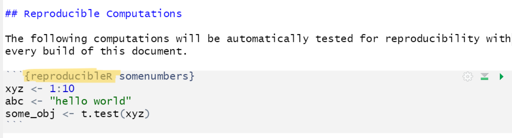

# reproducibleRchunks

## Why should I care?

This package allows you to make computational results in R testable for reproduction (does the same script with the same data produce the same results, e.g. on a different computer and/or later in time). There is only a single thing you need to change in your analysis if you are already using RMarkdown: Change the code chunk type from `r` to `reproducibleR`. It's that easy:



## Demo

Here is how you can check it out for yourself. Install the package and render `test.Rmd` to assess reproducibility of its R code chunks. Each code chunk will render a reproducibility report. One chunk is set up to fail to demonstrate the package.

## Mechanics

The package executes reproducibleR code chunks as regular R code and gathers information about all variables that are newly defined in a given chunk. The contents of those variables are stored in a separate JSON data file (which is labelled according to the original Markdown file and the chunk label). Once the document is re-generated and JSON data files exist, their content is checked against the newly computed chunk variables for identity.

Here is an example of how the contents of two objects are stored, which is a single variable called `numbers` with a vector of five numbers `[0.874094, -1.6943659, -0.8961591, 1.00840087, 1.61713635]` (rounded to a specified precision):

```{json}
{
  "type": "list",
  "attributes": {
    "names": {
      "type": "character",
      "attributes": {},
      "value": ["numbers"]
    }
  },
  "value": [
    {
      "type": "double",
      "attributes": {},
      "value": [0.874094, -1.6943659, -0.8961591, 1.00840087, 1.61713635]
    }
  ]
}
```

For privacy reasons (and to save disk space), we actually do not store the raw data by default but only fingerprints of the data, which do not allow to reproduce the original data.

## Notes

Do not store critical and/or large data as raw data in reproducibleR chunks. In particular, do not store raw data (too large and possible breach of data protection laws, privacy issues), passwords (security risk as they would be stored in clear text), etc.
