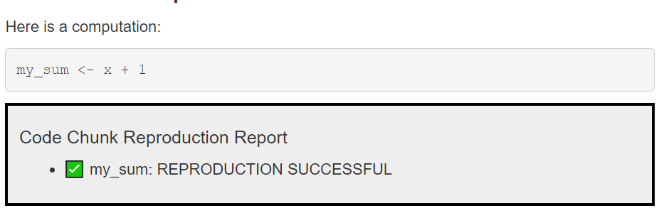

# reproducibleRchunks 

 <!-- badges: start -->
  [](https://lifecycle.r-lib.org/articles/stages.html#stable)
  <!-- badges: end -->

Preprint available on PsyArXiV: [https://osf.io/preprints/psyarxiv/3zjvf](https://osf.io/preprints/psyarxiv/3zjvf)

## Why should I care?

This package allows you to make computational results in R testable for reproduction (does the same script with the same data produce the same results, e.g. on a different computer and/or later in time). There is only a single thing you need to change in your analysis if you are already using RMarkdown: Load the package at the beginning of your R Markdown file (`library(reproducibleRchunks)`) and change the code chunk type from `r` to `reproducibleR`. It's that easy:


## Installation

```
devtools::install_github("brandmaier/reproducibleRchunks")
```

## Demo

Here is how you can check it out for yourself. Install the package and render `test.Rmd` to assess reproducibility of its R code chunks. Each code chunk will render a reproducibility report. One chunk is set up to fail to demonstrate the package. Here is what will happen.

### Step 1: Document is built for the first time:


First, all newly declared variables in an `reproducibleR` chunk are identified, their contents are fingerprinted, and the fingerprints are stored in a so-called JSON file.

### Step 2: Document is re-built and automatically checked for reproducibility

All computational results are reproduced, fingerprinted and their fingerprints are compared against the fingerprints in the JSON storage. If results are identical, all is well, otherwise you will get a failure message.



## Mechanics

The package executes reproducibleR code chunks as regular R code and gathers information about all variables that are newly declared in a given chunk. The contents of those variables are stored in a separate JSON data file (which is labelled according to the name of original Markdown file and the chunk label preceded by the prefix `.repro` and ending with the suffix `.json`). Once the document is re-generated and a corresponding JSON data files exist, their content is checked against the newly computed chunk variables for identity.


It is possible to either store the contents as fingerprints (default) or as plain content. Here is an example of how the contents of two objects are stored in plain format.
In this example, there is a single variable called `numbers` with a vector of five numbers `[0.874094, -1.6943659, -0.8961591, 1.00840087, 1.61713635]` (rounded to a specified precision):

```{json}
{
  "type": "list",
  "attributes": {
    "names": {
      "type": "character",
      "attributes": {},
      "value": ["numbers"]
    }
  },
  "value": [
    {
      "type": "double",
      "attributes": {},
      "value": [0.874094, -1.6943659, -0.8961591, 1.00840087, 1.61713635]
    }
  ]
}
```

For privacy reasons (and to save disk space), we actually do not store the raw data by default but only fingerprints of the data, which do not allow to reproduce the original data.

## What kind of variables can be tested for reproducibility?

Virtually any kind of variable can be subjected to a reproducibility test by defining it within a `reproducibleR` code chunk in a R Markdown document, no matter whether it is a numeric result, a character string, or a more complex object such as the result from a call to `t.test()` (or any other statistical model):


## Notes

Do not store critical and/or large data as raw data in reproducibleR chunks. In particular, do not store raw data (too large and possible breach of data protection laws, privacy issues), passwords (security risk as they would be stored in clear text), etc.
Do not subject results from current date or current time functions as they are supposed to change over replications.
Make sure to use random seeds if your analysis is based on random numbers and note that results from the default random number generator may vary between R versions.

## License

The figures (in directory `inst/img` of this repository) are all provided under Creative Commons 4.0 CC-BY license. All code is provided under the MIT license. 
